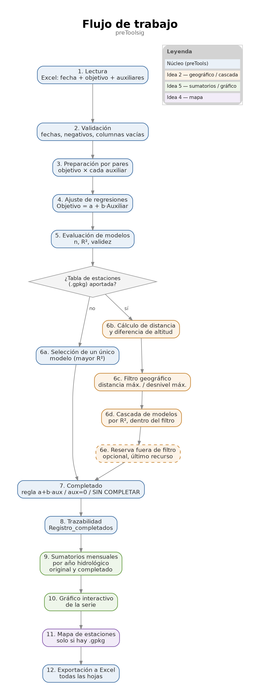

  

preToolsig
==========

Completado de series de precipitación diaria mediante regresión lineal
simple entre estaciones meteorológicas, en R, con visualización
interactiva y sumatorios por año hidrológico.

Proyecto continuación de **preTools** (repositorio anterior,
conservado intacto como referencia), que amplía el motor de cálculo
original con componente de análisis y, en una fase posterior, con
selección de estaciones auxiliares por criterios geográficos (SIG).

**Aplicación en funcionamiento:** (pendiente de publicar la nueva
versión en shinyapps.io)

Este repositorio contiene el código fuente y su documentación; la
aplicación se despliega de forma independiente en shinyapps.io. Un
cambio en el repositorio no actualiza la aplicación en funcionamiento
de forma automática.

----------------------------------------------------------------------
AVISO
----------------------------------------------------------------------

preToolsig es una herramienta de apoyo técnico y no sustituye la
validación profesional de los datos ni de los resultados obtenidos.

----------------------------------------------------------------------
¿QUÉ PROBLEMA RESUELVE?
----------------------------------------------------------------------

Las series de precipitación diaria de una estación meteorológica casi
siempre tienen huecos (días sin registro, por avería del sensor, falta
de mantenimiento, etc.). Para muchos análisis hidrológicos (balances
hídricos, diseño de infraestructuras, estudios de recursos) se necesita
una serie continua, sin huecos.

preToolsig completa automáticamente esos huecos utilizando el dato de
otra estación cercana ("estación auxiliar") con la que la estación
incompleta ("estación objetivo") esté bien correlacionada, mediante una
regresión lineal simple:

    Objetivo = a + b · Auxiliar

Además, genera una visualización interactiva de la serie resultante y
un resumen de sumatorios mensuales agrupados por año hidrológico, para
facilitar la revisión rápida del resultado.

----------------------------------------------------------------------
¿QUÉ HACE EL SCRIPT, PASO A PASO?
----------------------------------------------------------------------

1. Lectura: carga un Excel con una columna de fecha, una columna de la
   estación a completar y una o varias columnas de estaciones
   auxiliares.

2. Validación: detecta y avisa de fechas no interpretables, columnas
   vacías y valores negativos de precipitación (físicamente
   imposibles), sin modificar nada automáticamente.

3. Preparación por pares: para cada estación auxiliar, construye un
   subconjunto con únicamente las fechas donde tanto la objetivo como
   esa auxiliar (y solo esas dos) tienen dato. Esto aprovecha el
   máximo de información disponible para cada par.

4. Ajuste de regresiones: calcula la recta de regresión para cada par,
   comprobando que el ajuste sea numéricamente válido (variabilidad
   suficiente, coeficientes finitos, R² calculable). Si un ajuste no
   es válido, se descarta sin detener el proceso y queda documentado
   el motivo.

5. Selección del mejor modelo: entre las estaciones auxiliares que
   superan un número mínimo de datos y un R² mínimo (configurables),
   se elige la de mayor R².

6. Completado: aplica la ecuación seleccionada sobre la serie completa
   original, con tres reglas:
     - auxiliar = 0            -> completado = 0
     - auxiliar tiene valor    -> completado = a + b · auxiliar
     - auxiliar también es NA  -> no se completa, queda marcado

7. Trazabilidad: cada valor completado queda registrado con la fecha,
   el método usado, la estación auxiliar empleada y los coeficientes
   del modelo. Cada fila de la serie final queda etiquetada como
   Original / Completado (regresión) / Completado (auxiliar=0) /
   SIN COMPLETAR.

8. Sumatorios por año hidrológico: agrupa la serie (original y
   completada, por separado) en meses de octubre a septiembre,
   calculando el sumatorio y el número de datos disponibles (n) de
   cada celda mes x año hidrológico, más el total anual por año
   hidrológico (AH1, AH2, ...).

9. Visualización: genera un gráfico interactivo (línea de la serie
   completada + puntos coloreados según el estado de cada valor) con
   zoom sobre el eje temporal, disponible tanto en la app Shiny como
   desde la consola de R.

10. Exportación: genera un único Excel con los datos originales, los
    datos completados, el registro de trazabilidad, la tabla resumen
    de todos los modelos evaluados (no solo el elegido), las tablas de
    sumatorios por año hidrológico (original y completada, con su
    hoja de leyenda de rangos de calendario) y, para cada par
    objetivo-auxiliar, una hoja con los datos exactamente usados en
    esa regresión.

11. Filtro geográfico y cascada de modelos (opcional): si se aporta
    una tabla maestra de estaciones (GeoPackage), se descartan las
    auxiliares que superen una distancia máxima y/o una diferencia
    de altitud máxima (ambos parámetros opcionales e independientes)
    respecto a la estación objetivo. En vez de aplicar un único
    modelo "ganador", se prueban TODAS las auxiliares que superan el
    filtro, de mayor a menor R², antes de dejar una fecha sin
    completar — así se maximiza la cobertura sin sacrificar la
    coherencia física/orográfica. Sin tabla de estaciones, el
    comportamiento es idéntico al de antes (un único modelo, por n y
    R²).

12. Reserva fuera de filtro geográfico (opcional, desactivada por
    defecto): si tras agotar la cascada anterior aún quedan fechas
    sin completar, y se activa explícitamente este parámetro, se
    recurre como último recurso a auxiliares que el filtro
    geográfico había descartado, también por orden de R². Estos
    valores quedan etiquetados de forma distinta y visible en todos
    los sitios (Excel, gráfico, Shiny) para diferenciarlos de los
    obtenidos dentro del filtro.

13. Mapa de estaciones (solo si se usó tabla maestra de estaciones):
    muestra todas las estaciones de la tabla sobre un mapa
    interactivo, coloreadas según su papel en la ejecución concreta
    (objetivo, auxiliar usada, auxiliar evaluada sin uso, descartada
    por filtro geográfico, descartada por n/R² insuficiente, o no
    evaluada en esta ejecución), con un popup por estación con su
    distancia, diferencia de altitud, R² y valores completados. No
    repite ningún cálculo: solo traduce a colores y texto la misma
    tabla de modelos ya generada en los pasos anteriores.

----------------------------------------------------------------------
ESTRUCTURA DEL REPOSITORIO
----------------------------------------------------------------------

    preToolsig/
    ├── docs/
    │   └── preTools_flujo_pipeline.png    Diagrama de flujo del proceso
    ├── ejemplos/
    │   ├── prueba_preToolsig.xlsx         Excel de prueba con datos sintéticos
    │   │                                   (incluye cruce de año hidrológico)
    │   ├── prueba_preToolsig_cascada.xlsx Variante para probar la cascada con
    │   │                                   dos auxiliares a la vez (idea 2)
    │   └── estaciones_prueba.gpkg         Tabla de estaciones de prueba (idea 2)
    ├── www/
    │   └── logo.png                       Logo (usado por la app y por este README)
    ├── .gitignore
    ├── LICENSE
    ├── README.md
    ├── app.R                              Interfaz Shiny
    └── preToolsig.R                       Motor de cálculo (independiente de Shiny)

(Este es el orden real en el que GitHub los mostrará: primero las
carpetas por orden alfabético, después los archivos, también por
orden alfabético pero distinguiendo mayúsculas de minúsculas — las
mayúsculas se listan antes que las minúsculas.)

`preToolsig.R` puede usarse de forma completamente independiente,
directamente desde R/RStudio, sin necesidad de Shiny ni de ninguna
interfaz. `app.R` es una capa de interfaz que llama a las funciones de
`preToolsig.R` (mediante `source("preToolsig.R")`), sin duplicar ni
modificar su lógica.

----------------------------------------------------------------------
TECNOLOGÍA
----------------------------------------------------------------------

R (readxl, dplyr, purrr, writexl, tibble, stringr, tidyr, plotly, sf,
leaflet), interfaz web con Shiny. Tabla maestra de estaciones en
formato GeoPackage (.gpkg), CRS de trabajo EPSG:25830 (ETRS89 / UTM
huso 30N).

----------------------------------------------------------------------
ESTADO ACTUAL
----------------------------------------------------------------------

Prototipo funcional, probado tanto con datos reales de estaciones de
precipitación como con un caso de prueba sintético diseñado a propósito
para verificar cada regla de completado (regresión, auxiliar=0,
auxiliar=NA, valores negativos, columnas vacías).

Completa actualmente una única estación objetivo por ejecución (la
segunda columna del Excel de entrada). Incorpora ya la visualización
interactiva, los sumatorios por año hidrológico, la selección de
estación auxiliar por criterios geográficos con cascada de modelos y
reserva opcional fuera de filtro, y el mapa interactivo de estaciones.
Con esto quedan cerradas las ideas 2, 4 y 5 de la ampliación inicial.

----------------------------------------------------------------------
PRÓXIMOS PASOS
----------------------------------------------------------------------

- Extender el proceso para completar varias estaciones objetivo en una
  misma ejecución.
- Publicar la nueva versión en shinyapps.io y GitHub (pendiente de
  decidir el momento).

----------------------------------------------------------------------
AUTOR
----------------------------------------------------------------------

Proyecto personal de Raúl Gómez C., orientado a facilitar el flujo de trabajo de
oficinas de gestión de recursos hídricos.
